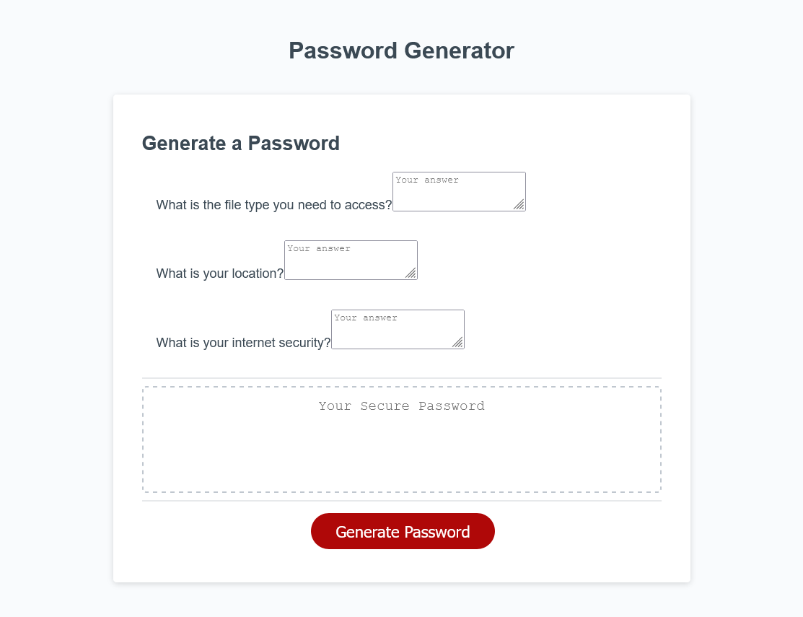

<<<<<<< HEAD
# Password-Generator
## Description:
An application that generates a random password based on user-selected criteria. The app runs in the browser and features dynamically updated HTML and CSS powered by your JavaScript code. It has a clean and polished user interface and is responsive, which ensures that it adapts to multiple screen sizes.
To do this I had to learn about Math.random, Math.floor, and window.commands. The entire process makes the computer program more interactive.
https://erikaroguie.github.io/Password-Generator/
## Installation
The program is added to the existing code. The user only has to answer the questions.

### Useage

=======
# Password-Generator
## Description:
An application that generates a random password based on user-selected criteria. The app runs in the browser and features dynamically updated HTML and CSS powered by your JavaScript code. It has a clean and polished user interface and is responsive, which ensures that it adapts to multiple screen sizes.
To do this I had to learn about Math.random, Math.floor, and window.commands. The entire process makes the computer program more interactive.
https://erikaroguie.github.io/Password-Generator/
## Installation
The program is added to the existing code. The user only has to answer the questions.

### Useage

>>>>>>> refs/remotes/origin/main
Erika Sanders